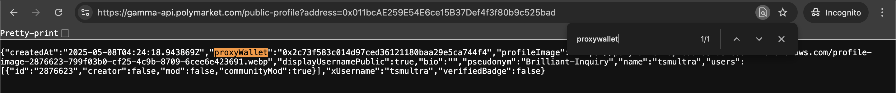
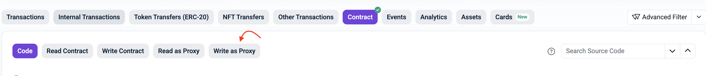
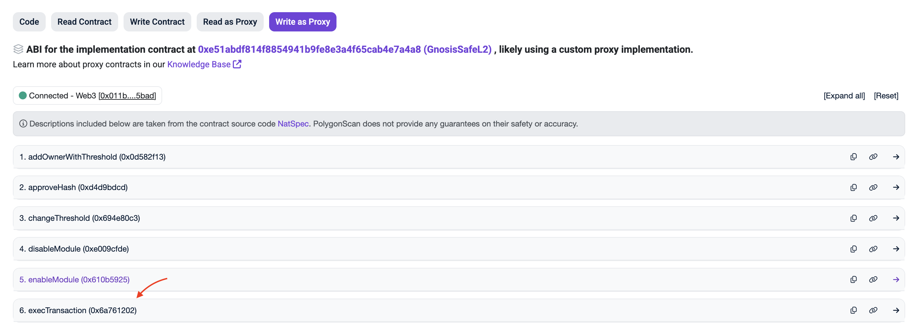

# A Quick and Dirty Guide on How to Withdraw USDC.e from Your Polymarket Wallet via Polygonscan

This guide explains how to transfer funds directly from your Polymarket wallet to your MetaMask wallet by interacting with your proxy wallet (a Gnosis Safe smart contract) through Polygonscan.

---

## Prerequisites

Before you start, you will need:

1. **Your Polymarket proxy wallet address.** This is the address associated with your Polymarket profile. You can get it by clicking on the small profile icon on your Polymarket profile page, or by looking for the `proxyWallet` field through this link:
   ```
   https://gamma-api.polymarket.com/public-profile?address=YOUR_METAMASK_ADDRESS
   ```



2. **Your MetaMask wallet** that you used to sign up on Polymarket. It should be funded with a small amount of POL tokens on the Polygon network. Make sure to switch your MetaMask wallet to the Polygon network in advance.

3. **The destination address**, i.e., the address where you want to send the funds. This can be your MetaMask wallet address or any other EVM address. **Important:** if you want to send the funds to a deposit address on a CEX, make sure that it supports USDC.e deposits beforehand.

---

## Step 1. Prepare your Calldata

This is the most important part, where you need to build 2 pieces of data that you will use later on Polygonscan.

> **Please be careful and double-check that you build them correctly.** If you make a mistake in the destination address portion of the `data` field and accidentally change one or more characters of the padded address, the funds will be sent to a wrong (likely non-existent or someone else's) address and will be **unrecoverable**.

### 1. The `data` field

The `data` field encodes the transfer instruction and is always built the same way:

```
0xa9059cbb
+ [destination address, padded to 32 bytes]
+ [amount in smallest units, padded to 32 bytes]
```

**Destination address padding:** Take your destination address, remove the `0x` prefix, and add 24 zeros to the left. For example:

```
Address:        0x011bcAE259E54E6ce15B37Def4f3f80b9c525bad
Padded address: 000000000000000000000000011bcae259e54e6ce15b37def4f3f80b9c525bad
```

**Amount:** USDC.e has 6 decimal places, so multiply your dollar amount by 1,000,000 and convert to hex. Common amounts:

| Amount | Decimal | Hex |
|--------|---------|-----|
| $1 | 1,000,000 | `f4240` |
| $5 | 5,000,000 | `4c4b40` |
| $10 | 10,000,000 | `989680` |
| $100 | 100,000,000 | `5f5e100` |

Pad the hex value with leading zeros until it is **64 characters long**. For example, $1 (`f4240`) becomes:

```
00000000000000000000000000000000000000000000000000000000000f4240
```

Combine everything to get the final `data` field. For example, $1 to `0x011bcAE...` becomes:

```
0xa9059cbb000000000000000000000000011bcae259e54e6ce15b37def4f3f80b9c525bad00000000000000000000000000000000000000000000000000000000000f4240
```

> **Verify before submitting:** count the characters after `0x`. There should be exactly **136 characters**. If there are more or fewer, the amount will be wrong.

### 2. The `signatures` field

This field is needed to prove you are the owner of the proxy wallet. Replace `{YOUR_EOA}` with your MetaMask address without the `0x` prefix, all lowercase:

```
0x000000000000000000000000{YOUR_EOA}000000000000000000000000000000000000000000000000000000000000000001
```

For example, for address `0x011bcAE259E54E6ce15B37Def4f3f80b9c525bad`:

```
0x000000000000000000000000011bcae259e54e6ce15b37def4f3f80b9c525bad000000000000000000000000000000000000000000000000000000000000000001
```

---

## Step 2. Open Polygonscan

1. Open your proxy wallet address on Polygonscan:
   ```
   https://polygonscan.com/address/YOUR_PROXY_WALLET_ADDRESS
   ```
   For example: `https://polygonscan.com/address/0x2c73f583c014d97ced36121180baa29e5ca744f4`

2. Click the **Contract** tab.


3. Click the **Write Contract as Proxy** tab.


   
5. Click **Connect to Web3** and connect your MetaMask wallet. Make sure it is on the Polygon network.



---

## Step 3. Fill in the execTransaction form

Scroll down to find **`execTransaction`** and click to expand it.



Fill in the fields exactly as follows:

| Field | Value |
|-------|-------|
| `payableAmount (ether)` | `0` |
| `to (address)` | `0x2791Bca1f2de4661ED88A30C99A7a9449Aa84174` |
| `value (uint256)` | `0` |
| `data (bytes)` | *(your `data` field from Step 1)* |
| `operation (uint8)` | `0` |
| `safeTxGas (uint256)` | `0` |
| `baseGas (uint256)` | `0` |
| `gasPrice (uint256)` | `0` |
| `gasToken (address)` | `0x0000000000000000000000000000000000000000` |
| `refundReceiver (address)` | `0x0000000000000000000000000000000000000000` |
| `signatures (bytes)` | *(your `signatures` field from Step 1)* |

> **Important:** The `to` address (`0x2791Bca1...`) is the USDC.e token contract on Polygon. This never changes.

---

## Step 4. Submit the transaction

1. Click **Write**.
2. MetaMask will show a transaction request. Make sure it says **"Interacting with: GnosisSaf..."** and the network is **Polygon**.
3. Confirm the transaction in MetaMask.
4. Wait a few seconds for the transaction to be confirmed.

---

## Step 5. Verify

Go to your proxy wallet address on Polygonscan and check the **Token Transfers (ERC-20)** tab. You should see a transfer of USDC.e from your proxy wallet to the destination address.
